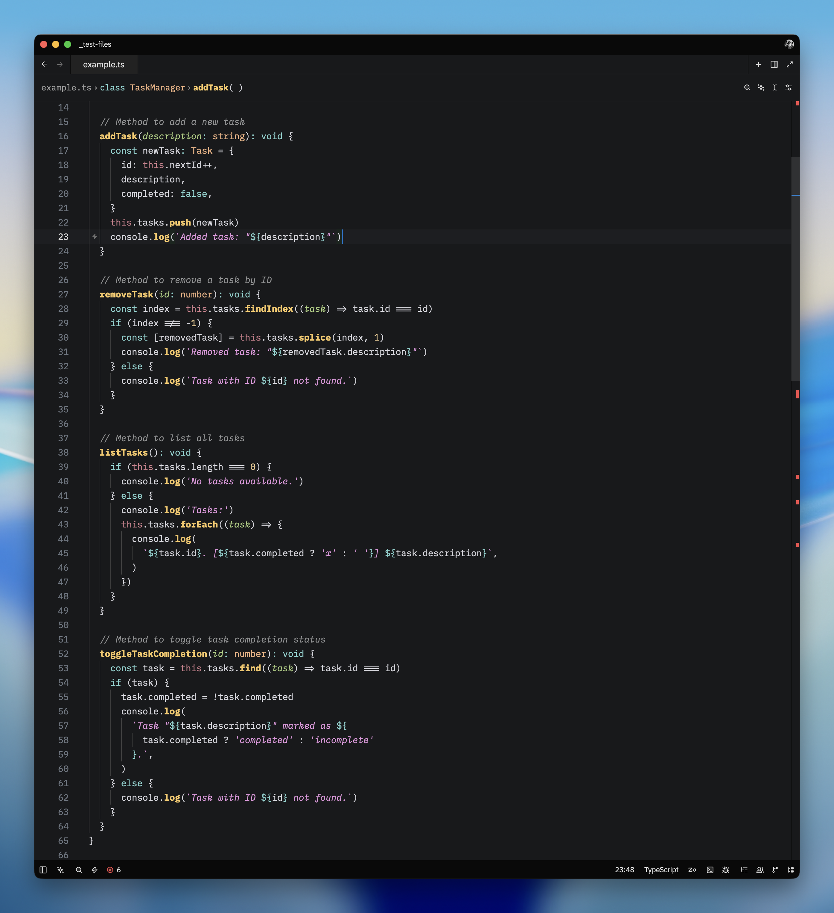
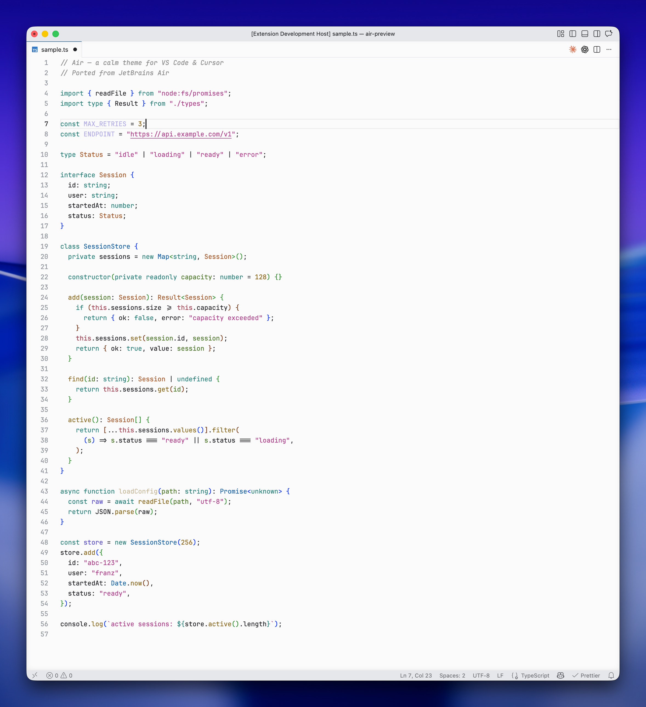
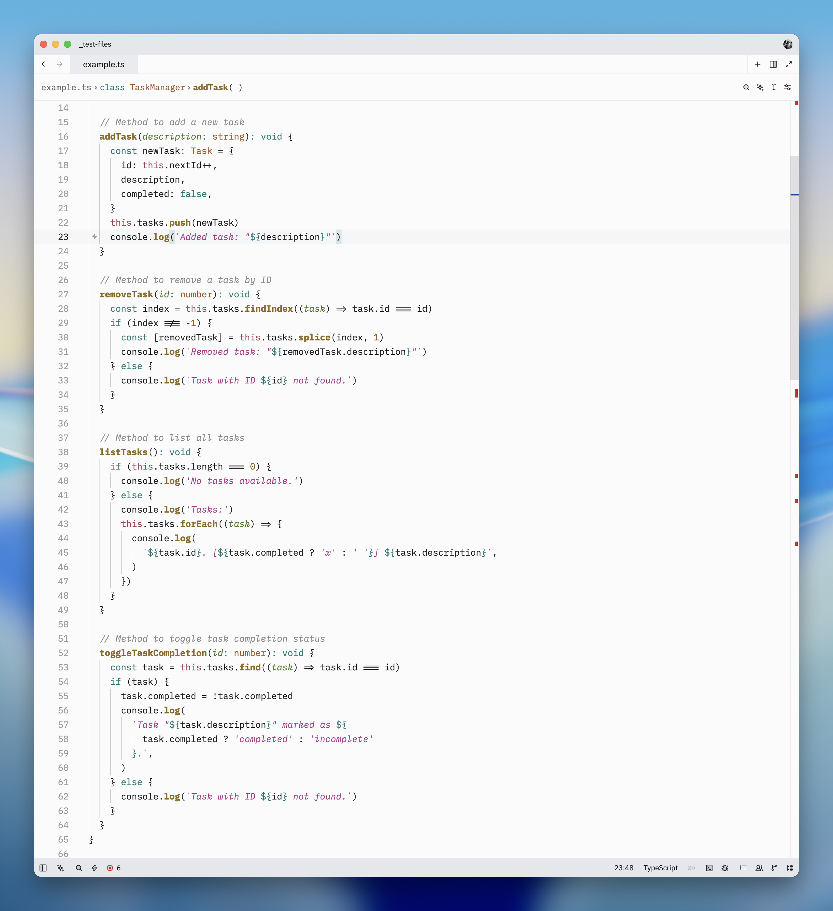

# Air Theme for Zed

<p align="center">
  
</p>

Zed port of [JetBrains Air](https://github.com/franzgollhammer/air-theme-vscode) — a calm theme family with lavender keywords, pink strings, amber numbers, and green types.

## Variants

Four variants included:

- **Air Dark** — Dark theme
- **Air Dark Italic** — Dark with italic parameters/strings and bold functions
- **Air Light** — Light theme
- **Air Light Italic** — Light with italic parameters/strings and bold functions

### Air Dark


### Air Dark Italic



### Air Light



### Air Light Italic



### Italic styles

| Token                                             | Style                   |
| ------------------------------------------------- | ----------------------- |
| `function`, `function.method`, `function.builtin` | **bold**                |
| `variable.parameter`                              | _italic_                |
| `string`, `string.escape`, `string.regex`         | _italic_                |
| `comment`                                         | _italic_ (all variants) |

## Installation

### From the Extensions tab

1. `cmd+shift+x` → open Extensions
2. Search for "Air Theme"
3. Click Install
4. `cmd+k cmd+t` → pick a variant

### Manually (dev extension)

```bash
git clone https://github.com/franzgollhammer/air-theme-zed
```

1. Open Zed
2. `cmd+shift+p` → `zed: install dev extension`
3. Select the cloned folder
4. `cmd+k cmd+t` → pick a variant

## Terminal themes

Matching terminal themes in `terminal-themes/`:

- **Ghostty** — `terminal-themes/ghostty/air-dark`, `air-light`
- **iTerm2** — `terminal-themes/iterm2/air-dark.itermcolors`, `air-light.itermcolors`
- **Warp** — `terminal-themes/warp/air-dark.yaml`, `air-light.yaml`

## Color palette

### Dark

| Role       | Hex       |
| ---------- | --------- |
| Background | `#18191B` |
| Foreground | `#dddddd` |
| Comment    | `#909192` |
| String     | `#E394DC` |
| Keyword    | `#82D2CE` |
| Function   | `#F8C762` |
| Type       | `#EFB080` |
| Variable   | `#AAA0FA` |
| Parameter  | `#A8CC7C` |
| Number     | `#EBC88D` |
| Tag        | `#87C3FF` |

### Light

| Role       | Hex       |
| ---------- | --------- |
| Background | `#FBFBFC` |
| Foreground | `#1F2024` |
| Comment    | `#8C8C8C` |
| String     | `#B03A88` |
| Keyword    | `#1F7F78` |
| Function   | `#8D6B1F` |
| Type       | `#A85A29` |
| Variable   | `#5A4ECF` |
| Parameter  | `#4E7A2A` |
| Number     | `#8F6614` |
| Tag        | `#1C5DB5` |

## Matching icons

Pair this theme with [Air Icons for Zed](https://github.com/franzgollhammer/air-icons-zed) — JetBrains Air-inspired file icons designed to match this color palette.

## Related projects

- [Air Icons for Zed](https://github.com/franzgollhammer/air-icons-zed)
- [Air Theme for VSCode](https://github.com/franzgollhammer/air-theme-vscode)
- [JetBrains Air (original)](https://www.jetbrains.com/help/idea/working-with-themes.html)

## Publishing

See the [Zed Extensions docs](https://zed.dev/docs/extensions/themes).

PR against [zed-industries/extensions](https://github.com/zed-industries/extensions):

```bash
git submodule add https://github.com/franzgollhammer/air-theme-zed extensions/air-theme
```

Add to `extensions.toml`:

```toml
[air-theme]
submodule = "extensions/air-theme"
version = "0.1.0"
```

## License

MIT
